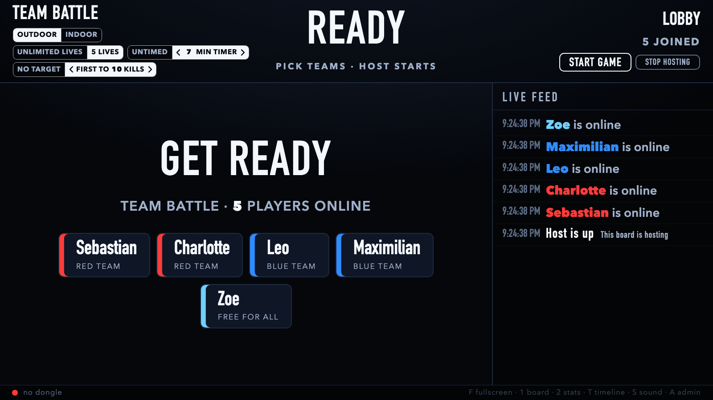
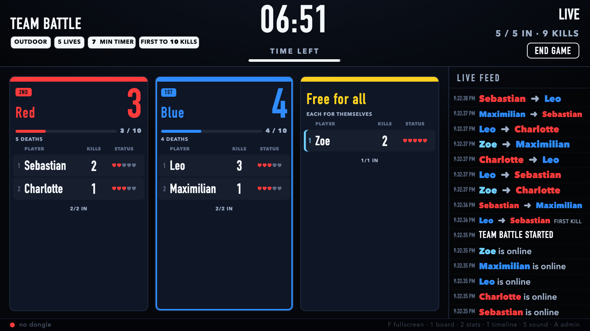

# SWAPTX Host and Scoreboard

A live scoreboard, event timeline and optional game host for **SWAPTX Evolver** laser tag
(guns + Wireless Head Sensors). One ESP32 dongle on a USB cable hears every ESP-NOW
radio frame the gear exchanges; a Python backend turns that into per-player and
per-team stats, a game clock, and a full timeline; a wall view made for a projector
shows it all big and bright.

Out of the box the board only listens: a gun in admin mode hosts the game exactly as
stock SWAPTX intends. Press **HOST A GAME** on the wall and the dongle becomes the host
instead, speaking the same protocol the admin headset does (mapped live in
[docs/mapping-2026-09-13.md](docs/mapping-2026-09-13.md)), with house rules the guns never
had: a game length of your own and first-to-N-kills.

```
Guns + headsets  ──ESP-NOW LR──▶  ESP32 sniffer dongle  ──USB serial──▶  laptop backend  ──WiFi──▶  wall view / admin / phones
(players 1-16, host ...:ff)        firmware/swaptx_sniffer          python -m swaptx           http://laptop:8000
```

## Screenshots

Hosting from the board (simulated players): the lobby with the house-rule toggles, and a
Team Battle under way with a board timer, first-to-10 and a lone wolf.





## Hardware

* **Lonely Binary ESP32 WROOM-32UE IPEX antenna kit** (or any classic ESP32-WROOM-32U board
  with the external antenna screwed on *before* power-up). Not S3/C3/C6.
* A data-capable USB cable to the laptop. Optionally a USB extension so the dongle sits high with a view of the field.

## Quick start

```bash
cd swaptx-scoreboard
./run.sh fg --simulate       # fake game, no hardware, in the foreground: open http://localhost:8000
```

With the dongle:

```bash
brew install arduino-cli     # once
./flash.sh                   # compiles firmware/swaptx_sniffer and flashes the first USB serial port
./run.sh                     # makes sure exactly one board is running (starts it if not) and prints its URLs
./run.sh status              # is it up, which dongle, since when      ./run.sh restart · stop · log · fg
```

`./run.sh` is safe to run any time: it never starts a second copy, stops a stray duplicate, and
restarts a board that is up but not answering. The board keeps its state in `data/swaptx.db` and
logs to `data/server-8000.log`.

Open **http://&lt;laptop-ip&gt;:8000/** on the machine driving the projector (press `F` for
fullscreen) and **http://&lt;laptop-ip&gt;:8000/admin** on a phone to set names. Projecting from
behind the screen? Press `M`, or open `/?mirror=1` once: the whole wall flips left-to-right and
that browser remembers it.

Tests: `./.venv/bin/python -m pytest -q`

## What you get

**Wall view** (`/`) - dark, high-contrast, sized in `vmin` so it fills any projector:
* Top bar: game mode + setting chips (5 lives / unlimited in Team Battle and FFA, 200 / 500 HP in Battle Royale, timed/storm, indoor/outdoor, your house rule), a giant **game clock** (time left when the host's 10-minute timer or your display rule is on, elapsed otherwise, storm label in Battle Royale), phase badge, players alive.
* Team Battle: one column per team with a huge score, per-player kills / deaths / hearts, offline dot. Only the leading team is outlined (it is a team game); Free for All outlines the leading player; Battle Royale outlines nobody, since it is last one standing. With hearts on show the deaths column is dropped (hearts lost say the same thing) and the IN count sits centred under the list.
* Battle Royale: standings with IN / OUT and "N standing of M". One life, so there is no deaths column and no ratio at the finish.
* Lobby: "GET READY" with a tile per online player in their team color. Idle: last game's result + dongle status.
* Live feed: kills as `Name ➜ Name` in team colors with the wall-clock time, joins, with FIRST KILL / STREAK ×n / who's out noted under the row.
* Game over: winner screen, awards (MVP, Best Ratio, Longest Streak, First Kill, Most Deaths, Untouchable, Last Kill), final standings.
* Vocabulary is the guns' own: **kills** and **deaths** (a gun shows its own when you press reload twice), **lives** shown as hearts, and **out** when they're gone. The radio only ever reports a death, never single hits or damage. Every word lives in one table in `web/common.js`.
* Free for All: everyone for themselves with lives and respawns, sorted by kills. The radio beacon only distinguishes Team Battle and Battle Royale, so pick it in Admin → Game → Game type (or it is used automatically if the beacon ever carries mode 2).
* Live feed: newest event drops in at the top; the list scrolls (wheel, touch, `↑`/`↓`, `Home`) and stays pinned while you are at the top. Every row is one line of the same height; text shrinks to fit rather than wrapping. Commentary (FIRST TAG, STREAK ×n, TAGGED A TEAMMATE, OUT) sits on the tag row itself. Nothing ever pops over the board. With three or four teams the feed narrows to give the columns room.
* Free for All gives every player their own colour, since there are no teams to colour by.
* Timed games: when the guns' own 10-minute timer is on, the clock counts down. If the host's game-over beacon is never heard, the wall ends the game itself 45 s after time ran out (only if nobody scored after the deadline; storm-mode royale never auto-ends). Adjustable in Admin → Game.
* Keys: `F` fullscreen, `1` board, `2` stats, `T` full timeline, `S` sound effects, `A` admin, `↑`/`↓`/`Home` scroll the feed.

**Admin** (`/admin`): team colour → team name ("SHARKS WIN" instead of "RED TEAM WINS"), gun number → player name / team override, display rules (time limit, first-to-N, label), dongle status and channel control, every timeline event (including hidden system ones), raw radio frames with decoding, a **Protocol lab** to re-label message fields, and game history with CSV/JSON export.

## Per-player state tracked

kills, deaths, K/D, current + best streak, death streak, lives left (5-life games) / eliminated, alive time, first blood, last kill/death time, kills by victim and deaths by killer (nemesis / favorite victim), friendly-fire kills, base captures, gun-reported running score, gun restarts, join time and late-join flag, host ack, online state, RSSI (signal strength) - plus per-team kills, deaths, objective points, alive count and score.

## Hosting from the board

The dongle can be the admin headset. Turn it on with **HOST A GAME** in the wall's top-right corner
(or Admin → Game → Host mode). The dongle then takes the host address `00:00:00:00:00:ff`, so
the guns' headsets get their unicasts acknowledged and treat the board as their host, and keeps
sniffing at the same time. The board sends only what the stock admin headset was seen sending:

* `36,90,1,1` twice when hosting starts, and the lobby beacon (phase 3) with the current settings;
* the settings chips in the top-left become buttons — click a chip to cycle it (mode, lives / HP,
  timer / storm, lighting) — and every change re-announces the lobby beacon;
* every report-in is acknowledged (`36,97`, placeholders in the lobby, real settings in a game);
* **START GAME** sends the start beacon twice; **END GAME** (click twice) sends the game-over with the
  winner the board worked out: a colour, or 10 + player index when everyone is on free-for-all;
* every state report (`36,101`) is acknowledged with `36,102`;
* the game ends by itself the way the stock host did: a few seconds after an elimination leaves one
  team (or one player) standing, or when the 10-minute timer runs out.

Everything the board transmits is also written to the history as a frame from the host address, so
replays and the wall treat its beacons like a real host's. The dongle never decides anything on its
own; it only sends what the backend tells it (`tx,<dst>,<payload>` over serial) and remembers that it
is the host across reboots. The transmit rate defaults to 1 Mbps (any receiver decodes it); Admin
can switch to the guns' own rate (MCS1) if a headset ignores the default.

Not reproduced, because it was never observed: whatever the stock host does during a storm in
Battle Royale, and the exact message at timer expiry (the board sends a normal game-over then).

## Stock SWAPTX vs DIY host gear

The radio protocol was learned from LaserTagMods' DIY host, which imitates the stock Evolver host gun
and adds its own toys. Keep the two apart:

* **Stock Evolver** (what this board is for): guns + wireless headsets, a host gun that starts and
  stops games, two host modes (Team Battle, Battle Royale) plus a team pick of Red, Blue, Green or
  Free for All (the yellow one, radio token 2): a Team Battle where everyone picks Free for All is a
  Free for All, and the board detects that on its own. The gun cycles Red → Green → Free for All →
  Blue; the board maps tokens 0/1/2/3 to Red/Blue/Free for all/Green after the DIY host's source, so
  if the first real game shows token 1 on green guns, swap Blue and Green in `TEAM_NAMES` /
  `TEAM_COLORS` (`swaptx/protocol.py`). Then the settings in the start
  beacon (lighting, time on/off, mode, health/lives), elimination announcements, report-ins and the game-over
  message. Respawning is handled by the gun itself; the host gun has no respawn setting and there are
  no bases. Guns ignore teammates, so there is no friendly fire: a team's score is simply its eliminations, and
  a same-team elimination on the radio is logged as a warning (Admin → History) because it means a player's
  team was mis-assigned or the elimination message is being read wrong.
* **DIY LaserTagMods only**: JBOX/JCUBE bases and `CAPTURE` messages, "objectives" (first to N,
  domination, capture the flag), fields, arcade mode, BRX/JEDGE taggers, and the "Respawn -
  Trigger / Base" option (a token in the beacon that the stock gun never lets you change). The board
  decodes these so nothing on the air is lost, but anything it shows from them is labelled "JBOX" and
  never appears with stock gear; the respawn token is only visible in Admin → Protocol lab.

## The radio protocol (what the code understands)

Mapped live on 2026-09-13 with the sniffer, an admin gun and two players; the full session log is
`docs/mapping-2026-09-13.md`. Frames are ASCII in a 32-byte text field (`36,<opcode>,<args...>,42`,
opcodes are ASCII letters) followed by uninitialised memory. The headset is the radio and spoofs
its sender address to its gun's ID (`00:00:00:00:00:01..10` = guns 1..16); the admin headset is
the host, `...:ff`; `ff:ff:ff:ff:ff:ff` is everyone. Player indices on the wire are 0-based.

| Message | Who -> whom | Meaning |
|---|---|---|
| `36,90,1,1` | host -> all (x2) | host came up: a gun entered admin mode |
| `36,79,<p>,<lives>,<team>,<phase>,1` | player -> host | online / state. Sent every 4.3 s for ~3 min after a headset links to its gun, and in a hosted game until acked. Lives: 100 = just linked (team token meaningless), 1 = idle, 5 / 255 / 1 in a game (five lives / unlimited / Royale). Team 0 red 1 blue 2 free-for-all 3 green. Phase 3 idle, 1 in game |
| `36,97,1,<phase>,<lighting>,<respawn>,<time>,<mode>,<lives>,1` | host -> player | acknowledgement; placeholder zeros in the lobby (phase 3), real settings in a game |
| `36,65,<origin>,<lighting>,<respawn>,<phase>,<time>,<mode>,<lives>,1` | host -> all (x2), relayed by every player with origin 0 | phase 3 = lobby open / settings, phase 1 = START. lighting 0 high/outdoor 1 low/indoor; time 1 = on (storm in Royale); mode 0 Team Battle 1 Battle Royale; lives 0 low (5 lives / 200 HP) 1 high (unlimited / 500 HP); the respawn token is a DIY-host leftover |
| `36,75,<shooter>,<victim>,1` | victim -> shooter | damage taken: 3-5 per death whatever the sensor hit, so never a hit count and no health |
| `36,68,<killer>,<victim>,<victim team>,0,0,1` | victim -> shooter | the victim died: this is the elimination |
| `36,101,<p>,<team>,<lives>,<kills>,c,d,e,1` | player -> host | state report after each kill (d=1) and at elimination / game over (d=2, e=1); lives count down from 255 in an unlimited game |
| `36,102,<p>,1,0,1` | host -> player | acknowledgement of a state report |
| `36,69,<origin>,<winner>,1` | host -> all (x2), relayed with origin 0 | GAME OVER: winner 0-3 = team colour, 10 + player index = an individual (everyone on free-for-all) |
| `CAPTURE,<jbox>,<team>,<player>` | DIY only | a LaserTagMods JBOX base was captured (stock SWAPTX has no bases) |
| `$XX,...,*` | DIY only | BRX / JEDGE tagger traffic (a different gear line) |

Things the air does not carry: single hits, health, respawns (a respawn is silent), teammate hits
(the gun ignores them and nothing is sent), and there is no host "end game" other than the game
ending by elimination or timer. Unicasts are retried by the radio until acknowledged (same 802.11
sequence number): the board folds those. A listen-only sniffer hears the player-to-player hit and
death messages; the LaserTagMods DIY host, which only received frames addressed to itself, never
did, which is why its scoreboard relied on the state report and read its lives field as a score.

## Teams

**Health / Lives.** The host's one setting means two things (the DIY host labels it "Health/Lives -
Low/5, High/Unlimited"; the Evolver host gun shows HP in Battle Royale and lives in Team Battle).
In Team Battle and Free for All, Low is 5 lives (shown as hearts) and High is unlimited: every elimination costs a
heart, and with none left the player is out. In Battle Royale it is hit points, Low = 200 and
High = 500, and there is one life. Hits and damage never reach the radio, only the elimination, so the
board can't show health. The HP numbers and the heart count are editable in Admin → Game.

**Column order.** Team columns sit in the order their colour was first heard this game (a carried-over guess counts) and never move; the second slot is held open with a dashed "Team ?" column until the second colour is heard.

**Checking against the guns.** Press a gun's reload button twice to show its own kills and
deaths; those should match the board's kills and deaths for that player after a game.

The radio never announces a team pick. A player's team is learned from their first kill
announcement in each game. Being tagged also tells the board something: a tag proves the
tagger and the victim are on different teams, so each player keeps a list of teams they
cannot be on. With two colours in play that pins the victim's team (shown with a `?` and a
hatched row until their own first tag confirms it); while only one colour has been heard,
players it has tagged sit in the open "Team ?" column. A guess sticks until a later tag
contradicts it. Otherwise the wall shows last game's team, flagged the same way, or whatever
you set in Admin → Players. Precedence: radio (this game) beats the manual override, which
beats the worked-out team, which beats the carried-over team. Battle Royale is every player for themselves: the host firmware names its rules "F4A" (free for all),
tracks "last player alive", and only calls a game a team battle when it sees more than one team in play.
So royale and Free for All ignore team colors entirely and give each player their own color. Free for All (SWAPTX's third mode) is the same but with lives and
respawns; the recovered host firmware never sends a distinct mode value for it, hence the Admin override.

## Motion

Every change on the wall animates: new feed rows slide down from the top, rows glide when the
ranking changes, numbers pop when they change, team scores flash, hearts pulse when a life goes.
Names are auto-fitted to their column and never truncate. Each team column is a CSS container, so type and spacing scale with the column's real width for 2, 3 or 4 teams, and rows compress so 8 players per column (16 total) still fit. Text is optically centred in rows by measuring the real glyph ink at runtime.

## Restarts

* **Backend restart**: every frame is in `data/swaptx.db`; on startup the last 24 h (and any
  open game) are replayed through the reducer, so the wall comes back exactly where it was.
* **Dongle unplugged / rebooted**: the reader reconnects every 2 s; boots show in the timeline
  and the sniffer re-locks its channel (auto-scan after 2 min of silence).
* **Game restarted by the host**: a new start beacon ends the running game ("superseded") and
  starts a fresh one; repeated start beacons within 8 s are one start.
* **Gun power-cycled mid-game**: detected from a re-report-in or a reported score that drops;
  the board keeps its own count and notes the restart.
* **Missed beacons**: a kill or a host confirm with phase=1 starts a game the dongle didn't
  hear begin; Admin has display-only start/end/lobby buttons for anything else.
* Duplicates from retransmits / relays are folded (identical payload within 3 s).

## Firmware notes

`firmware/swaptx_sniffer/swaptx_sniffer.ino` (Arduino-ESP32 core 2.x or 3.x):
promiscuous capture of ESP-NOW vendor-specific action frames with 802.11b/g/n **and LR**
enabled, so host↔player *and* player↔player unicasts are heard, not just broadcasts.
It never transmits or ACKs. Serial commands: `chan,N`, `scan`, `autoscan,0|1`,
`mode,sniff|espnow`, `raw,0|1`, `status`, `reboot`. The backend also understands the stock
LaserTagMods transceiver's `Received message from: <mac> - <payload>` output, so the
prebuilt `ESP32 TRANSCIEVER.bin` works too (broadcasts + host-addressed frames only).
